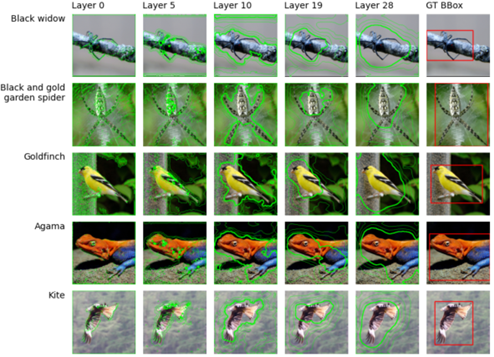

# feedback-attention-cnn
This repository contains implementations of brain-inspired CNN models that implement 
Feedback Attention and Saccade behaviour, as described in our paper 
_Object-based Attention Improves Tumour Detection in Digital Pathology_. 

(A link to the paper will be supplied here once a preprint edition has been published online.) 

## Feedback Attention Ladder CNN

The Feedback Attention Ladder CNN (FAL-CNN) is a VGG19-based CNN with additional convolutional feedback pathways
controlling spatial and channel attention at multiple convolutional levels in the feedforward path. 
This architecture has been found to enhance classification accuracy, and provides attention distributions that 
highlight salient objects.

The script _**ExecuteFeedbackAttentionCNN.py**_ instantiates a FAL-NN model,
initialises its weights from a specified file then executes the FAL-CNN against a specified input image. 

The feedback attention model outputs a predicted class, which is reported to a specified log file. 

The model also returns a collection of its feedback activations, at different levels in the model. 
These are used to generate plots to visualise the model's attention regions, 
superimposed on the original input image.

For ImageNet-100 input images, further plots are generated showing the region of the XML bounding box 
annotation where available:



### Function arguments

The **_ExecuteFeedbackAttentionCNN_** script requires the following inputs. 
If running in PyCharm, these can be configured in the Run Configuration 
based on the _ExecuteFeedbackAttentionCNN_ example supplied. 

1. Path to attention weights of pre-trained FAL-CNN model, as .PTH file.
2. Path to RGB input image, e.g. in ImageNet-100 Validation set, as JPEG or PNG
3. Path for local log file output
4. Path to output directory, where generated images will be saved
5. Optional path to directory of XML files containing ImageNet bounding box annotations

### Example syntax

```
python ExecuteFeedbackAttentionCNN.py ./model-weights/fal-cnn-1-iterations-ImageNet100-split-001.pth ./ImageNet-100/Test/000-chambered_nautilus/ILSVRC2012_val_00033974.JPEG ./output/logs/ExecuteFeedbackAttentionCNN.log ./output/attention-visualisations
```

## Data requirements

1. Pre-trained feedback model weights, for 1, 2 or 3-iteration FeedbackAttentionLadderCNN in _classes/classifier_ are available from https://zenodo.org/doi/10.5281/zenodo.10361266
2. ImageNet-100 Validation set should be downloaded to local directory from Kaggle Challenge site at https://www.kaggle.com/datasets/ambityga/imagenet100
3. Optional ImageNet bounding box annotations (XML files) are available from https://image-net.org/download-bboxes.php


## Saccade model: Python script

The Saccade model implements a vision-inspired algorithm for tracking to salient features in a larger input image. 

The script _**ExecuteSaccadeModel.py**_ constructs and executes a Saccade model,
using an embedded FAL-CNN feedback attention model to sample a sequence of 224x224px image regions 
within a 448x448px input image. The inner region is 
initially taken from the centre of the larger image, then tracks to follow the 
Centre of Attention (CoA) derived from mean feedback activations in the FAL-CNN.

This script outputs visualisation plots showing sampled regions with overlaid 80%
attention contours and their centroids, for the initial region and each 
subsequent saccade iteration.

### Function arguments

The _**ExecuteSaccadeModel**_ script requires the following inputs. 
If running in PyCharm, these can be configured in a Run Configuration 
based on the _ExecuteSaccadeModel_ example supplied.

1. Path to attention weights of pre-trained FAL-CNN model, as .PTH file
2. Path to RGB input image, e.g. in ImageNet-100 Validation set, as JPEG or PNG
3. Path for local log file output
4. Output directory path for feedback visualisation plots
5. Number of saccade iterations required

### Example syntax

```
python ExecuteSaccadeModel.py ./model-weights/fal-cnn-1-iterations-ImageNet100-split-001.pth ./Image000-chambered_nautilus/ILSVRC2012_val_00033974.JPEG ./output/logs/ExecuteSaccadeModel.log ./output/saccade-visualisations 5
```

## Saccade model: Jupyter notebook for composite plots

Once _**ExecuteSaccadeModel**_ has been executed for an input image, the 
Jupyter notebook _**SaccadeViewer.ipynb**_ can be used to generate a composite plot
showing the sequence of saccade movements and associated regions of high attention.


Local variables **_input_dir_** and **_saccade_inputs_** should be configured with the
output directory path and input image filenames used in _ExecuteSaccadeModel_.

## Python environment

The following shell commands are used to create and configure a Python environment supporting execution
on an HPC environment or local Anaconda installation. 
It is recommended to run these commands against a new, named Conda environment for this project, 
to protect pre-existing package versions in your base environment. 

_The PyTorch versions specified below were chosen for compatibility with the CUDA and NVIDIA-SMI drivers on the HPC nodes 
used by the author (11.5 and 495.29.05 respectively). If your local installation uses a different version
of CUDA you may need to substitute compatible PyTorch versions. The following websites document the relationship 
between given CUDA and PyTorch versions:_ 

https://discuss.pytorch.org/t/pytorch-for-cuda-10-2/65524 

https://pytorch.org/get-started/previous-versions/.

If no CUDA installation exists, the above code will automatically run on the available CPU instead.
```
# HPC-specific commands to install Conda and CUDA runtime; include or replace these as appropriate to your system
module load anaconda 
module load cuda

# Create and activate Python environment
conda create --name feedback-attention-env python=3.7
source activate feedback-attention-env

# Install required Python libraries
pip install libarchive openslide-python
conda install pandas
pip3 install torch==1.10.1+cu113 torchvision==0.11.2+cu113 -f https://download.pytorch.org/whl/cu113/torch_stable.html
pip install sklearn tqdm matplotlib scikit-image shapely descartes efficientnet_pytorch python-interface opencv-python
pip install -U jsonpickle
```

